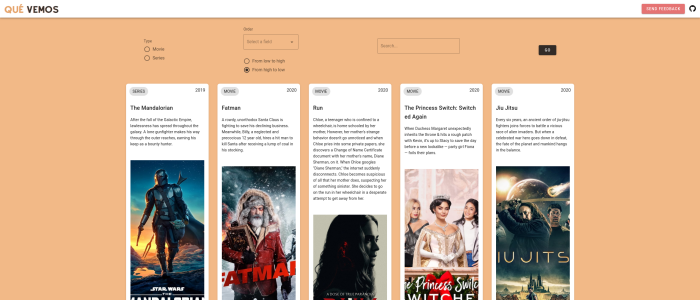
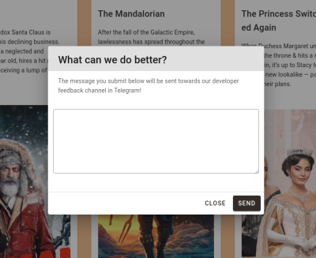

# ¿Qué vemos?


[](https://codecov.io/gh/AlexMenor/que-vemos)
[](https://app.netlify.com/sites/amazing-villani-e2d732/deploys)

<p align="center">
  
</p>

> "Lemur designed by Freepik"

## El problema

¿Te agobia la indecisión al elegir una nueva serie que empezar? ¿No encuentras una película que haga justicia a las palomitas que acabas de hacer?

¿Y no es aún peor cuando esta decisión la tienes que tomar junto a tus padres? ¿O tu pareja?

## Herramientas

- **Python**: Utilizando _features_ modernas del lenguaje, como _async/await_ o _typing_.
- **Framework Web**: Que permita especificar de forma declarativa endpoints (_REST_ y _Websockets_) y los documente automáticamente conforme a algún estándar, por ejemplo _Open API_.
- **Logging**: Para conocer mejor el uso que los usuarios hacen del servicio e identificar problemas.
- **Fuente de datos de películas y series**: API externa, crawler o base de datos ya populada. En cualquier caso, tiene que estar "al día".
- **Memoria de sesiones**: Cuando los usuarios interactúan con el servicio, en alguna parte se tienen que almacenar temporalmente estructuras de datos que representen las elecciones que están haciendo.

## Serverless
### Get Trending Watchables
La primera función que he implementado usando serverless corresponde a [HU8: Como usuario, quiero poder obtener una lista de películas y series para ver ejemplos de lo que puedo elegir en la aplicación. Filtrar por películas/series, ordenarlas, buscar, ...](https://github.com/AlexMenor/que-vemos/issues/53).

Esta función la [he alojado en netlify](https://amazing-villani-e2d732.netlify.app/.netlify/functions/get_trending_watchables
) admite peticiones GET con los siguientes query parameters opcionales:
- 'type': Permite filtrar por tipo (películas o series) 'MOVIE' o 'SERIES'.
- 'search': Busca en las synopsis y títulos la cadena de caracteres proporcionada.
- 'orderBy': Ordena en base al siguiente criterio. `[campo],[orden]`. En `campo` admite 'popularity' y 'year'. En `orden` admite 'DESC' y 'ASC'.

[Esta](app/serverless/get_trending_watchables.js) es la función y [estos](app/serverless/test/trending_watchables.test.js) sus tests que se ejecutan automáticamente en [esta](.github/workflows/qa.yml) github action.

Además, he implementado [este frontend](https://amazing-villani-e2d732.netlify.app/) que se puede ver en [su carpeta](frontend) del repositorio.



Mi intención es que esta función se llame cada vez que un usuario entre a la página, de esta forma lo primero que ve son unas cuantas películas y series entre las que decidir. Incentivando que inicie una sesión con alguien. 
Así, el microservicio que se implementará más adelante tiene menos carga y se dedica solamente a administrar las sesiones.

### Watchables Extractor
No directamente relacionado con serverless pero esencial para que la función anterior funcione y obtener todas estas películas y series he implementado un script en Python que es ejecutado por una Github Action diariamente.
- Obtiene los datos de [the movie db](https://www.themoviedb.org/). En concreto, las películas y series "trending" del día.
- Los parsea para instanciar entidades de mi aplicación.
- Serializa las instancias con pickle en binario, pensado para que el microservicio los consuma, y en JSON para que las funciones serverless (que he escrito en JS) los utilicen.
- Por último hace commit y push al repositorio.

El script [es este](app/data/watchables_extractor.py), los test son [estos](app/tests/test_watchables_extractor.py) y la github action es [esta](.github/workflows/refresh-data.yml).

### Send Feedback
La otra función que he implementado usando FaaS corresponde a [HU9: Como desarrollador, quiero que los usuarios puedan dar feedback fácilmente.](https://github.com/AlexMenor/que-vemos/issues/58)
- Solo admite el método POST y devuelve un código 405 de lo contrario.
- Solo admite un cuerpo con formato: `{"feedback":[string]}`, de lo contrario devuelve un código 400.
- Hace un _profanity filter_ en inglés con el mensaje y devuelve 400 si es ofensivo.
- Por último, usando la API de Telegram, envía el mensaje a través de un bot a [este canal](https://t.me/sugerenciasQueVemos).

Esta función se usa también en el frontend.



La función es [esta](app/serverless/send_feedback.js) y los tests son [estos](app/serverless/test/send_feedback.test.js).

### Despliegue
El despliegue de estas funciones y el frontend lo he hecho en Netlify. Pese a que se puede hacer desde la UI, he configurado todo con [netlify.toml.](netlify.toml)
Antes de usar esta plataforma he probado:
- Azure Functions: Soporta python y hubiera sido una ventaja para no tener que serializar los datos también en json, pero me daba un error 500 al usar su cli y no fui capaz de solucionarlo.
- AWS Lambda: Mismas ventajas que azure. Utilicé una cuenta AWS Educate y no me permitió crear el bucket S3 necesario para alojar una función.
- Google Cloud Functions: Siguiendo su guía de integración con repositorios de Github, me daba un error sin descripción que tampoco pude solucionar.
- Vercel: Impone una estructura de proyecto determinada y quería que las funciones serverless tuvieran más cohesión con todo el proyecto, estando en el mismo repositorio.

Finalmente, para probar también otro servicio, he implementado ambas funciones en [un repositorio aparte](https://github.com/AlexMenor/firebase-functions-que-vemos) para Firebase.
Se despliegan con [esta github action.](https://github.com/AlexMenor/firebase-functions-que-vemos/blob/master/.github/workflows/deploy.yml) 

[Esta es GetTrendingWatchables](https://us-central1-que-vemos.cloudfunctions.net/getTrendingWatchables) y [esta es SendFeedback.](https://us-central1-que-vemos.cloudfunctions.net/sendFeedback
)

## Tests de mutación
Como avance extra también he introducido los tests de mutación a mi proyecto con [mutmut](https://github.com/boxed/mutmut). Complementan a los tests de cobertura para asegurar no solo que estamos haciendo tests, sino que estos son también de calidad.
Se ejecutan con `poetry run task mut`.

## Comandos

### Instalación de dependencias

```bash
poetry install
```

> Requiere Poetry instalado en el sistema. Este comando creará un virtualenv en un subdirectorio de \$HOME (donde se ha instalado Poetry) e instalará las dependencias necesarias.

### Lint

El proyecto utiliza [pylint](https://www.pylint.org/) para hacer **comprobaciones de sintaxis y estilo**:

```bash
poetry run task lint
```

### Test

Utilizo [pytest](https://docs.pytest.org/en/stable/):

```bash
poetry run task test
```

### Informe de cobertura

```bash
poetry run task cov
```

### Tests de mutación

```bash
poetry run task mut
```

## Documentación adicional

- [Configuración de git](docs/configurando-git.md)
- [Pasos de implementación](docs/pasos.md)
- [Más detalles del problema](docs/problema.md)
- [Historias de usuario y milestones](docs/hu-and-milestones.md)
- [Primer avance de código](app/entities/watchable.py)
- [Justificación de uso de @dataclass](docs/dataclass.md)
- [Sobre el task runner, Poetry](docs/task-runner.md)
- [¿Cómo se testea el proyecto?](docs/tests.md)
- [Contenedor entorno de tests](docs/contenedor-tests.md)
- [Integración continua](docs/integracion-continua.md)


## Agradecimientos


Por el acceso a [su API.](https://www.themoviedb.org/documentation/api)
