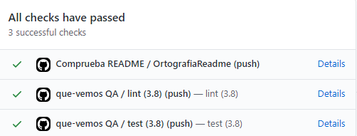

# ¿Qué vemos?

<p align="center">
  
</p>

> "Lemur designed by Freepik"

## El problema

¿Te agobia la indecisión al elegir una nueva serie que empezar? ¿No encuentras una película que haga justicia a las palomitas que acabas de hacer?

¿Y no es aún peor cuando esta decisión la tienes que tomar junto a tus padres? ¿O tu pareja?

## ¿Por qué he elegido este problema?

- Tengo personalmente este problema y me motiva resolverlo.
- De cara a la implementación me parece un proyecto interesante. Tiene fuentes de datos externas, persistencia temporal, REST y Websockets. Además, si tengo tiempo me gustaría diseñar un frontend que consuma el servicio.

## Interacción con el usuario

"Qué vemos" hace una selección de contenido, muestra una sucesión de películas/series en uno o varios clientes con conexión a internet (móvil, ordenador, ...) y cada uno decide si hacer "swipe left" o "swipe right". En cuanto haya una candidata en común, la selección parará y se mostrará la elección del grupo.

## Planteamiento del servicio

El servicio servirá peticiones de clientes a través de HTTP, con una API REST. Además hará uso de Websockets de forma puntual, entre otras cosas para hacer _push_ de alertas a los clientes (por ejemplo, que se ha encontrado una serie que les gusta a todos).
Necesita una fuente de datos (series y películas), que se concretará más adelante.

## Herramientas

- **Python**: Utilizando _features_ modernas del lenguaje, como _async/await_ o _typing_.
- **Framework Web**: Que permita especificar de forma declarativa endpoints (_REST_ y _Websockets_) y los documente automáticamente conforme a algún estándar, por ejemplo _Open API_.
- **Logging**: Para conocer mejor el uso que los usuarios hacen del servicio e identificar problemas.
- **Fuente de datos de películas y series**: API externa, crawler o base de datos ya populada. En cualquier caso, tiene que estar "al día".
- **Memoria de sesiones**: Cuando los usuarios interactúan con el servicio, en alguna parte se tienen que almacenar temporalmente estructuras de datos que representen las elecciones que están haciendo.

## Administración de dependencias y tareas: Poetry

De manera análoga a `package.json` en Node, Poetry utiliza `pyproject.toml` para definir todas las dependencias de nuestro paquete.

Por defecto, crea un entorno virtual en nuestro sistema con todas las dependencias y la versión de python especificadas en `pyproject.toml.`

Además permite ejecutar comandos dentro de este entorno con `poetry run`, por lo que podemos hacer `poetry run pytest` por ejemplo.

Sin embargo, he preferido añadir una dependencia de desarrollo que se llama [taskipy](https://pypi.org/project/taskipy/) que permite añadir en `pyproject.toml` alias de comandos más largos, por ejemplo: `poetry run pylint app` se queda en `poetry run task lint` (en este caso es igual de largo, pero más genérico).

## Tests

Utilizo [pytest](https://docs.pytest.org/en/stable/) porque la forma de hacer fixtures es muy simple y no hay apenas añadidos a python puro, es muy intuitiva.

En la documentación de _pytest_ se recogen dos patrones comunes: Poner la carpeta de tests fuera de la raíz de código (en este caso al mismo nivel que app) y poner la carpeta de tests dentro de la raíz de código (dentro de app). He acabado decantándome por esta segunda, ya que hay relación entre los test unitarios y los módulos, por ejemplo: `test_session.py` y `session.py.`

El primer patrón tiene sentido cuando los test son más funcionales.

[Mi primer fichero de tests.](app/tests/test_session.py)

He añadido también una github action que los ejecuta:



## Primera clase testeable

[Session](app/entities/session.py) representa el grupo de personas indecisas sobre qué película o serie ver. Para testearla basta con hacer `poetry run task test` (previo `poetry install`).

## Comandos

### Instalación de dependencias

```bash
poetry install
```

> Requiere Poetry instalado en el sistema. Este comando creará un virtualenv en un subdirectorio de \$HOME (donde se ha instalado Poetry) e instalará las dependencias necesarias.

### Lint

El proyecto utiliza [pylint](https://www.pylint.org/) para hacer **comprobaciones de sintaxis y estilo**:

```bash
poetry run task lint
```

### Test

Utilizo [pytest](https://docs.pytest.org/en/stable/):

```bash
poetry run task test
```

## Documentación adicional

- [Configuración de git](docs/configurando-git.md)
- [Pasos de implementación](docs/pasos.md)
- [Historias de usuario y milestones](docs/hu-and-milestones.md)
- [Primer avance de código](app/entities/watchable.py)
- [Justificación de uso de @dataclass](docs/dataclass.md)
