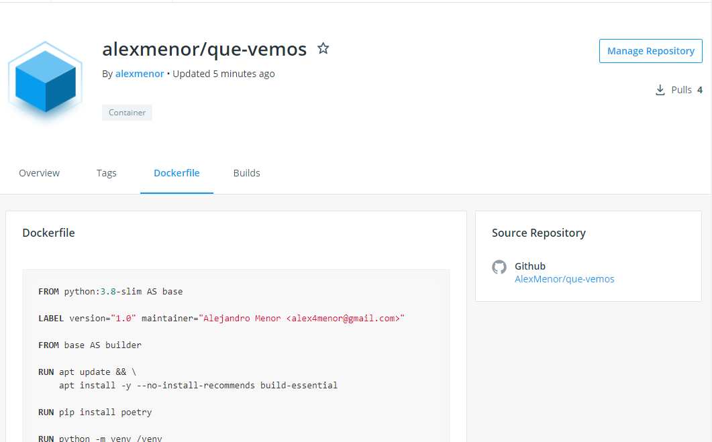
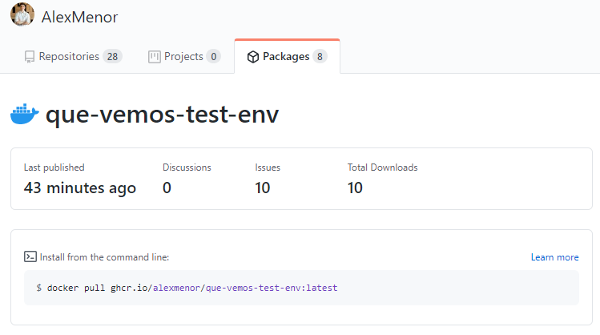

# ¿Qué vemos?

<p align="center">
  
</p>

> "Lemur designed by Freepik"

## El problema

¿Te agobia la indecisión al elegir una nueva serie que empezar? ¿No encuentras una película que haga justicia a las palomitas que acabas de hacer?

¿Y no es aún peor cuando esta decisión la tienes que tomar junto a tus padres? ¿O tu pareja?

## ¿Por qué he elegido este problema?

- Tengo personalmente este problema y me motiva resolverlo.
- De cara a la implementación me parece un proyecto interesante. Tiene fuentes de datos externas, persistencia temporal, REST y Websockets. Además, si tengo tiempo me gustaría diseñar un frontend que consuma el servicio.

## Interacción con el usuario

"Qué vemos" hace una selección de contenido, muestra una sucesión de películas/series en uno o varios clientes con conexión a internet (móvil, ordenador, ...) y cada uno decide si hacer "swipe left" o "swipe right". En cuanto haya una candidata en común, la selección parará y se mostrará la elección del grupo.

## Planteamiento del servicio

El servicio servirá peticiones de clientes a través de HTTP, con una API REST. Además hará uso de Websockets de forma puntual, entre otras cosas para hacer _push_ de alertas a los clientes (por ejemplo, que se ha encontrado una serie que les gusta a todos).
Necesita una fuente de datos (series y películas), que se concretará más adelante.

## Herramientas

- **Python**: Utilizando _features_ modernas del lenguaje, como _async/await_ o _typing_.
- **Framework Web**: Que permita especificar de forma declarativa endpoints (_REST_ y _Websockets_) y los documente automáticamente conforme a algún estándar, por ejemplo _Open API_.
- **Logging**: Para conocer mejor el uso que los usuarios hacen del servicio e identificar problemas.
- **Fuente de datos de películas y series**: API externa, crawler o base de datos ya populada. En cualquier caso, tiene que estar "al día".
- **Memoria de sesiones**: Cuando los usuarios interactúan con el servicio, en alguna parte se tienen que almacenar temporalmente estructuras de datos que representen las elecciones que están haciendo.

## Contenedor para entorno de pruebas

### Imagen base

Como mi proyecto está escrito en python, lo primero que hice fue investigar en [docker hub](https://hub.docker.com/_/python) las imágenes mantenidas por la organización.
Para cualquiera de las versiones tenemos tres opciones:

- **python:[version]**: Tiene como imagen base [buildpack-deps](https://hub.docker.com/_/buildpack-deps/) e incluye las utilidades más comunes de una distribución Debian. Por defecto, es la última versión de Debian estable (ahora mismo buster). Es ideal si vamos a utilizar unos pocos paquetes para la construcción y así no tener que instalarlos manualmente. En mi caso, como especificaré más adelante, no necesito apenas ninguno. Es la más pesada de las tres, ocupa casi 900 MB.
- **python:[version]-slim**: Con una base similar a la anterior pero más "delgada", solo contiene paquetes imprescindibles para ejecutar python. No incluye paquetes como gcc que nos hacen falta para construir alguna de las dependencias, sin embargo, pesa algo más de 100 MB por lo que puede merecer la pena.
- **python:[version]-alpine**: Con una base totalmente distinta a las dos anteriores. Es muy popular, sin embargo, con python tiene principalmente dos desventajas:

1. Las PyPI wheels no funcionan en alpine. Muchos de los paquetes que podemos instalar con `pip` vienen parcial o totalmente precompilados para reducir el tiempo de instalación. Sin embargo, estos paquetes se compilan con `glibc` y Alpine utiliza `musl`, lo que hace incompatibles estos binarios con esta imagen y nos fuerza a compilar todas las dependencias nosotros. Cabe mencionar que contra este inconveniente Alpine esta incluyendo estos binarios en su administrador de paquetes, pero lógicamente, va siempre por detrás de PypI.
   Esto evidentemente repercute mucho en nuestro tiempo de construcción.
2. El uso de `musl` tiene otra consecuencia y mientras que es mayormente compatible con `glibc`, hay lagunas y puede haber problemas. Por ejemplo: [Python puede crashear porque espera un tamaño de pila mayor](https://bugs.python.org/issue32307) o [puede ir más lento por la forma en la que `musl` asigna memoria](https://superuser.com/questions/1219609/why-is-the-alpine-docker-image-over-50-slower-than-the-ubuntu-image).

[Para más información...](https://pythonspeed.com/articles/alpine-docker-python/)

Por las pruebas que elaboro más abajo, he elegido la segunda opción.

### Dockerfile

Voy a utilizar el patrón conocido como "multi-stage builds", recogido [aquí](https://docs.docker.com/develop/develop-images/multistage-build/). Estos surgieron para hacer más fácil la optimización de Dockerfiles, sin sacrificar legibilidad. Esencialmente, definimos varias imágenes. Específicamente utilizo dos: Una para instalar dependencias que necesito para, valga la redundancia, instalar dependencias y otro para usar la construcción de la fase anterior y correr los tests.

Cuando se escribe un Dockerfile es conveniente, en la medida de lo posible, poner "más arriba" lo que menos va a cambiar. Por eso, empiezo instalando `build-essential`. Como pequeña optimización, el flag `--no-install-recommends` se asegura de que no instalamos más que el paquete en cuestión.

A continuación, instalo poetry con `RUN pip install poetry`. Como matiz, utilizo `pip` en vez de `curl` para instalarlo pues: 1. `curl` no viene instalado. 2. Tendría que añadir la ruta de instalación `$PATH` y es una capa más que meter a nuestro Dockerfile.

Cuando se empezaron a "Dockerizar" aplicaciones en Python, se consideraba una mala práctica utilizar entornos virtuales dentro del contenedor. Sin embargo, con los "multistage-builds" tiene todo el sentido del mundo generar un `venv` en la fase de construcción y consumirlo en la fase final y es justo lo que hago.

Una vez creo este entorno, copio `pyproject.toml` y `poetry.lock` y los utilizo para generar un `requirements.txt` que utilizará `pip` para instalar las dependencias en el `venv`.

Finalmente, ya en la fase final, copio el `venv` de la fase anterior y lo añado a `$PATH` para ejecutar sobre el volumen `/test` `pytest`.

Una pega que le pongo a este Dockerfile, es el no poder utilizar Poetry para ejecutar los tests. Si algún día decidiera cambiar a otra biblioteca de tests, tendría que cambiar a mano `CMD ["python", "-m", "pytest"]`, en vez de cambiarlo únicamente en `pyproject.toml`. Sin embargo, he decidido sacrificar eso a cambio de no aumentar la complejidad del Dockerfile y el tamaño de la imagen final.

[Dockerfile](./Dockerfile)

### Pruebas

Estas son las pruebas que he hecho respecto a tiempo de construcción y tamaño de la imagen con las dos decisiones más importantes que he tenido que tomar: Imagen base y el usar o no multistage build.

| Imagen estándar          | Imagen delgada          | Imagen delgada + multistage build |
| ------------------------ | ----------------------- | --------------------------------- |
| 112.41 segundos y 927 MB | 39.87 segundos y 381 MB | 48.93 segundos y 134 MB           |

Me he quedado con la última opción pesé a tardar algo más en construirse, ya que esta construcción solo se hará cuando cambien las dependencias del proyecto o el Dockerfile (como elaboro más abajo). Me parece en este caso más importante adelgazar la imagen final, pues la descarga de esta se hará en cada commit que haga en el proyecto.

### Integración continua

He configurado la publicación automática en dos registros de imágenes de contenedores: Docker Hub y Github Container Registry.




En cuanto a tiempo de construcción, en las pruebas que he hecho Github es más rápido. Este tarda en torno a 1 minuto, Docker Hub tarda unos 2 minutos.

Para este último he configurado la publicación en Github Actions y los test que tenía ahora corren en esta imagen.
Cuando vimos la explicación en clase, no sabía si de alguna forma podía evitar que un cambio en las dependencias o en el Dockerfile hagan fallar los tests en ese commit.
He conseguido evitarlo configurando una dependencia entre los tests y la construcción de la imagen.

Además, este proceso solo se hace si ha habido algún cambio en el Dockerfile o en las dependencias del proyecto, por lo que la construcción solo retrasa los test si es necesario.
[Link al workflow](.github/workflows/qa.yml)

Antes de correr los test en el contenedor, estos tardaban 27 segundos. Ahora tardan unos 13 segundos, lo cual es una mejora bastante grande, aunque al menos de momento insignificante.

## Comandos

### Instalación de dependencias

```bash
poetry install
```

> Requiere Poetry instalado en el sistema. Este comando creará un virtualenv en un subdirectorio de \$HOME (donde se ha instalado Poetry) e instalará las dependencias necesarias.

### Lint

El proyecto utiliza [pylint](https://www.pylint.org/) para hacer **comprobaciones de sintaxis y estilo**:

```bash
poetry run task lint
```

### Test

Utilizo [pytest](https://docs.pytest.org/en/stable/):

```bash
poetry run task test
```

## Documentación adicional

- [Configuración de git](docs/configurando-git.md)
- [Pasos de implementación](docs/pasos.md)
- [Historias de usuario y milestones](docs/hu-and-milestones.md)
- [Primer avance de código](app/entities/watchable.py)
- [Justificación de uso de @dataclass](docs/dataclass.md)
- [Sobre el task runner, Poetry](docs/task-runner.md)
- [¿Cómo se testea el proyecto?](docs/tests.md)
