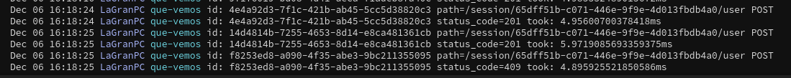

# ¿Qué vemos?


[](https://codecov.io/gh/AlexMenor/que-vemos)
[](https://app.netlify.com/sites/amazing-villani-e2d732/deploys)

<p align="center">
  
</p>

> Lemur designed by Freepik

¿Te agobia la indecisión al elegir una nueva serie que empezar? ¿No encuentras una película que haga justicia a las palomitas que acabas de hacer?

¿Y no es aún peor cuando esta decisión la tienes que tomar junto a tus padres? ¿O tu pareja?

## Microframework

Tras avanzar lógica de negocio, necesitamos un microframework que exponga operaciones al exterior mediante una interfaz REST y adicionalmente websockets.

En python podemos elegir (desde hace poco) entre un framework que implemente el estándar WSGI o el ASGI. Este último aprovecha las co-rutinas introducidas
en versiones modernas de python y por tanto mejora la utilización de CPU en servidores web que suelen hacer uso extensivo de I/O.

Muy relacionada con la elección de microframework está la elección de servidor. 
Como servidores ASGI tenemos:
- Uvicorn
- Daphne
- Hypercorn

Estoy utilizando Uvicorn porque utiliza como implementación del loop uvloop (que es una implementación más rápida escrita en C) algo que no tiene Daphne
y es más estable que Hypercorn que está en beta.
Sin embargo, no me compromete a nada porque puedo cambiarlo por otro más adelante sin tener que tocar una línea de código (los tres implementan el estándar ASGI).

En cuanto a microframeworks he considerado:
- Django/Channels: Hace Django compatible con async. Django es más un framework completo que un microframework.
- Starlette: Soporte para websockets, anotado con tipos, sin dependencias y muy rápido.
- Sanic: Maduro y con una interfaz muy limpia. Parecido a flask y con el mismo tratamiento de parámetros y cuerpo que starlette.
- Quart: Es una reimplementación de Flask para ASGI.
- FastAPI: Toma Starlette como base y añade conveniencias como validación, generación automática de documentación OpenAPI, sistema de inyección de dependencias, manejado de excepciones, etc...

Empecé a usar Starlette y FastAPI: Quería un microframework simple (django no lo es), que no me abstrajera demasiado de las peticiones y con mantenimiento y comunidad mediana detrás (punto en contra de Quart).
Sanic también cumplía estos requisitos, pero starlette cuenta con [una interfaz](https://www.starlette.io/endpoints/#websocketendpoint) para usar websockets muy cómoda.

Al final me decidí por FastAPI, cuenta con todas las ventajas de Starlette y la conveniencia de tener la documentación OpenAPI automáticamente implementada (intenté conseguir lo mismo en Starlette sin éxito), que además era [una historia de usuario](https://github.com/AlexMenor/que-vemos/issues/65).
También es más cómodo que starlette en el tratamiento de parámetros y cuerpo (se explica más abajo) sin dejar de permitir tratar con 
[peticiones a bajo nivel si es necesario](https://fastapi.tiangolo.com/advanced/using-request-directly/).

Además, su sistema de inyección de dependencias me ha sido muy útil en los tests de integración para hacer por ejemplo:
```python
watchables_store = InMemoryWatchablesStore()

session_handler_mocked = SessionHandlerDependency(watchables_store, Mock())

# Cambio la dependencia
app.dependency_overrides[session_handler_dependency] = session_handler_mocked

# Se ejecuta el test
yield session

# Deshago el cambio
app.dependency_overrides = {}
```

### Cómo lo uso
Las rutas las voy a declarar en [el directorio routes](routes), allí exporto un objeto de la clase `APIRouter` que importaré en [app.py](app/app.py) donde 
se "pegan" todas las rutas.
El objeto `router`, aparte de declarar todas las rutas con decoradores, sirve para definir un prefijo que llevarán todas ese rutas (en el caso de session routes `/session`) 
y una descripción para la documentación automática.


En el decorador de cada ruta también documento las distintas respuestas que puede haber desde cada ruta, para que se vean reflejadas en Swagger también.
```python
@router.post("/{session_id}/user",
          responses={404: {'description': 'Session not found'},
                     409: {'description': 'Session already has the maximum number of users'}},
          status_code=201, response_model=UserPayload)
```

Desde cada ruta, utilizo el manejador de sesiones que he venido desarrollando hasta ahora. Este manejador se inyecta:
```python
async def user_joins_session(session_id: str, session_handler: SessionHandler = Depends(session_handler_dependency)):
```
FastAPI se encarga de dos cosas ahí: 
- Que session_id tenga el valor que se pase en el parámetro de la ruta (lo hemos especificado en el decorador).
- En caso de necesitar extraer el cuerpo la petición (y validarlo) podemos declarar un modelo:
```python
class Vote (BaseModel):
    """ Represents that an user wants (or not) to see a watchable """

    watchable_index: int
    content: bool
```
Si alguno de los campos no esta presente o es de un tipo distinto al anotado, FastAPI devuelve un status code 422 con los detalles
de la validación.
- Inyectar session_handler.

Para esto último declaro antes:
```python
class SessionHandlerDependency:
    def __init__(self, watchables_store: WatchablesStore, session_store: SessionStore):
        self.session_handler = SessionHandler(watchables_store, session_store)

    def __call__(self):
        return self.session_handler


session_handler_dependency = SessionHandlerDependency(InMemoryWatchablesStore(), InMemorySessionStore())
```

De esta forma, puedo pasar como argumentos las implementaciones de WatchablesStore y SessionStore que quiera (en este caso las dos en memoria)
y se inyecta en las rutas en las que se declare como la anterior.

Como he dicho antes, para juntarlo todo está [app.py](app/app.py):
```python
app = FastAPI()

app.add_middleware(LoggingMiddleware)

app.include_router(session_routes.router)
```

Para implementar cualquier middleware, basta con extender la clase `BaseHTTPMiddleware` que provee FastAPI pero que está implementada en Starlette.
En esta clase hay que definir el método `dispatch`:
```python
async def dispatch(self, request, call_next):
```
Donde request es la petición y call_next es una co-rutina que nos devuelve la respuesta que se va a devolver
si usamos `await`. Esto nos permite definir middleware que tiene efectos cuando entra la petición y cuando sale la respuesta.


## Diseño de la API

### Rutas e historias de usuario
- ` POST /session`: Crea una sesión y devuelve su id (que es un UUID v4). Devuelve siempre un `201 CREATED` y corresponde a 
[HU2: Como usuario debo ser capaz de crear un "grupo" para que los demás se puedan unir de forma fácil](https://github.com/AlexMenor/que-vemos/issues/14)
- `POST /session/{session_id}/user`: Crea un usuario dentro de una sesión y corresponde a [HU11: Como usuario quiero poder unirme a un grupo ya existente](https://github.com/AlexMenor/que-vemos/issues/66). Si la sesión no existe devuelve `404 NOT FOUND` y si la sesión tiene ya el número máximo de usuarios devuelve `409 CONFLICT`.
Si todo va bien, devuelve `201 CREATED` y en el cuerpo este schema:
```python
{
  "user_id": "string",
  "session_id": "string",
  "watchables": [
    {
      "title": "string",
      "synopsis": "string",
      "year": 0,
      "type": "MOVIE",
      "poster": "string",
      "popularity": 0
    }
  ]
}
```
El `user_id` es en este caso también un uuid v4 que se usará junto a `session_id` para emitir un voto.
- `POST /session/{session_id}/user/{user_id}/vote `: Emite un voto en una sesión de un usuario a un "Watchable" y corresponde a [HU3: Como usuario, debo poder decidir si me gustaría o no ver una película / serie](https://github.com/AlexMenor/que-vemos/issues/23).
Require un cuerpo con este schema:
```
{
  "watchable_index": 0,
  "content": true
}
```
Si la sesión o el usuario no existen se devuelve un `404 NOT FOUND`.
Si `watchable_index` no es un índice válido en el array de "Watchables" se devuelve `400 BAD REQUEST`.
Si los tipos del cuerpo son incorrectos o algún campo no está presente, se devuelve `422 VALIDATION ERROR`.
En caso contrario se devuelve `201 CREATED`.
- `GET /session/{session_id}/summary`: Devuelve un resumen de la sesión y corresponde a [HU12: Como usuario quiero ver los resultados al final de la votación](https://github.com/AlexMenor/que-vemos/issues/67).
Si la sesión no existe devuelve `404 NOT FOUND`, de lo contrario devuelve `200 OK`
y un body con [este esquema.](app/entities/session_summary.py)

### Diseño por capas

En la aplicación se pueden ver tres capas diferenciadas:
- Interfaz: Expone rutas HTTP y trata las peticiones que llegan.
La forman: Servidor (Uvicorn), microframework (FastAPI), [middleware](app/middleware), [rutas](app/routes) y [app.py](app/app.py).
Para testear el código escrito en estos dos últimos (además de la integración de las capas) están [los tests de integración](app/tests/integration/test_session_routes.py).
- Lógica: [Entidades](app/entities) y [session_handler](app/session_handler.py).
- Persistencia: Todo bajo el directorio [data](app/data).
Se definen las interfaces de persistencia ([SessionStore](app/data/session_store/session_store.py) y [WatchablesStore](app/data/watchables_store/watchables_store.py)) y sus implementaciones (de momento solo persisten en memoria).
Además, contiene el script que extrae los datos todos los días [WatchablesExtractor](app/data/watchables_extractor/watchables_extractor.py).

Se ha aplicado inversión del control de forma que la interfaz y la persistencia dependan de la lógica y nunca al revés.

## Configuración

En el módulo [config](app/config/config.py) está toda la configuración de la aplicación.
- Desde otros módulos se puede importar `config` (que no es más que un diccionario) y la constante a utilizar. 
Por ejemplo, en la configuración de los logs:
```python
handler = SysLogHandler(address=(config[PAPERTRAIL_HOST], int(config[PAPERTRAIL_PORT])))

# (PAPERTRAIL_HOST, PAPERTRAIL_PORT están declaradas así)
PAPERTRAIL_HOST = 'PAPERTRAIL_HOST'
PAPERTRAIL_PORT = 'PAPERTRAIL_PORT'
#Al declararlas así no hay posibilidad de equivocarse al usarlas.

config['PAPERTRAIL_POST'] # Así sí me puedo equivocar

```
- En primer lugar se intentan obtener las variables de `etcd`.
- Si falla, usamos `dotenv` para tomarlas de un `.env` o del entorno si este no existe.
- Por último, se verifica la configuración:
    - Si el modo es producción deben estar todas las variables inicializadas.
    - Si el modo es desarrollo, todas deben estar inicializadas excepto la `PAPERTRAIL_*`  que explicaré más adelante.
    - Se lanza una excepción si falla esta verificación.


Los tests de este módulo se pueden ver [aquí](app/tests/unit/test_config.py).

Las variables declaradas hasta el momento son:
- MODE: Si se está ejecutando la aplicación en desarrollo o en producción. Más abajo lo explico en detalle.
-  NUM_OF_WATCHABLES_PER_SESSION: Cuántos watchables se votarán en cada sesión.
-  MAX_USERS_PER_SESSION: Cuántos usuarios máximos admite cada sesión.
-  PAPERTRAIL_HOST y PAPERTRAIL_PORT: Configuración de papertrail.

## Logs
Dos módulos fundamentales:
- [LoggingMiddleware](app/middleware/logging.py): Importa un `handler` de [logging_config](app/config/logging_config.py) (que explico a continuación) 
y por cada petición entrante:
    - Genera un id único.
    - Imprime id, path y método.
    - Mide el tiempo que ha tardado en responder el servicio.
    - Imprime id, status code y tiempo de respuesta en milisegundos.
- [Logging config](app/config/logging_config.py): Construye el handler por el que se imprimirán los logs.
Si el modo de ejecución es `dev` los imprime por consola. Si el modo de ejecución es `prod` los imprime en `PAPERTRAIL`.


De nuevo hay un desacoplamiento de la implementación concreta, haciendo el servicio de logging intercambiable.

## Tests de integración
Pese a utilizar un framework asíncrono, FastAPI [provee un cliente de tests](https://fastapi.tiangolo.com/tutorial/testing/) basado en [requests](https://requests.readthedocs.io/en/master/)
que permite programar estos tests con funciones síncronas.
Además de este cliente, también he considerado [HTTPX](https://github.com/encode/httpx) en los que las funciones sí son asíncronas.

Finalmente me he decantado por el primero porque es más estable, porque no tengo funciones asíncronas en los tests de integración
y porque tiene un estilo más simple:
```python
# Requests
def test_read_main():
    response = client.get("/")
    assert response.status_code == 200
    assert response.json() == {"msg": "Hello World"}
```
```python
# HTTPX
@pytest.mark.asyncio
async def test_root():
    async with AsyncClient(app=app, base_url="http://test") as ac:
        response = await ac.get("/")
    assert response.status_code == 200
    assert response.json() == {"msg": "Hello world"}
```

De todas formas, más adelante en caso de necesitarlo podría utilizar `HTTPX` en unos tests y `requests` en otros.
De momento, `requests` hace lo que necesito, es más estable y tiene una interfaz más simple.

Los tests que he implementado son [estos](app/tests/integration/test_session_routes.py) y corresponden
a las historias de usuario que he comentado en la sección de rutas.

En cuanto a la implementación de los mismos, destacar las fixtures con `yield` que están soportadas
por `pytest` y me permiten utilizar la inyección de dependencias de FastAPI sin repetir en todos los tests setup y teardown.

## Despliegue en heroku e imagen de producción

He creado [otro dockerfile](Dockerfile.web) para ejecutar el microservicio en producción.
Y he implementado [una github action](.github/workflows/deploy-to-heroku.yml) que construye la imagen, la publica en el 
registro de contenedores de heroku y por último la pone en producción [aquí](https://que-vemos.herokuapp.com/docs).
Se puede interactuar con el microservicio mediante la documentación de Swagger para probarlo y ver las operaciones disponibles.

Al estar ya en producción, se le han pasado las variables de entorno correspondientes y los logs se envían a papertrail.


## Comandos

### Instalación de dependencias

```bash
poetry install
```

> Requiere Poetry instalado en el sistema. Este comando creará un virtualenv en un subdirectorio de \$HOME (donde se ha instalado Poetry) e instalará las dependencias necesarias.

### Lint

El proyecto utiliza [pylint](https://www.pylint.org/) para hacer **comprobaciones de sintaxis y estilo**:

```bash
poetry run task lint
```

### Test

Utilizo [pytest](https://docs.pytest.org/en/stable/):

```bash
poetry run task test
```

### Informe de cobertura

```bash
poetry run task cov
```

### Tests de mutación

```bash
poetry run task mut
```

### Iniciar microservicio

```bash
poetry run task start
```

### Iniciar microservicio para desarrollo
En este modo al hacer cambios en cualquier fichero, la aplicación se reinicia.
```bash
poetry run task dev
```
## Documentación adicional

- [Configuración de git](docs/configurando-git.md)
- [Pasos de implementación](docs/pasos.md)
- [Más detalles del problema](docs/problema.md)
- [Historias de usuario y milestones](docs/hu-and-milestones.md)
- [Primer avance de código](app/entities/watchable.py)
- [Justificación de uso de @dataclass](docs/dataclass.md)
- [Sobre el task runner, Poetry](docs/task-runner.md)
- [¿Cómo se testea el proyecto?](docs/tests.md)
- [Contenedor entorno de tests](docs/contenedor-tests.md)
- [Integración continua](docs/integracion-continua.md)
- [Serverless](docs/serverless.md)
- [Tests de mutación](docs/tests-mutacion.md)


## Agradecimientos


Por el acceso a [su API.](https://www.themoviedb.org/documentation/api)
