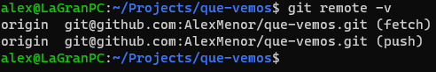

# Configuración correcta de Git

## Creación de par de claves y subida de clave pública
Como se indica en [la documentación de GitHub](https://docs.github.com/en/free-pro-team@latest/github/authenticating-to-github/about-ssh) es más comodo usar SSH que HTTPS, ya que no hace falta autenticarse con usuario y contraseña en cada petición a GitHub.

## Configuración correcta del nombre y correo electrónico para que aparezca en los commits correctamente
Para tener un link a nuestro perfil de GitHub es necesario tener git correctamente configurado con nuestro nombre y correo electrónico.

